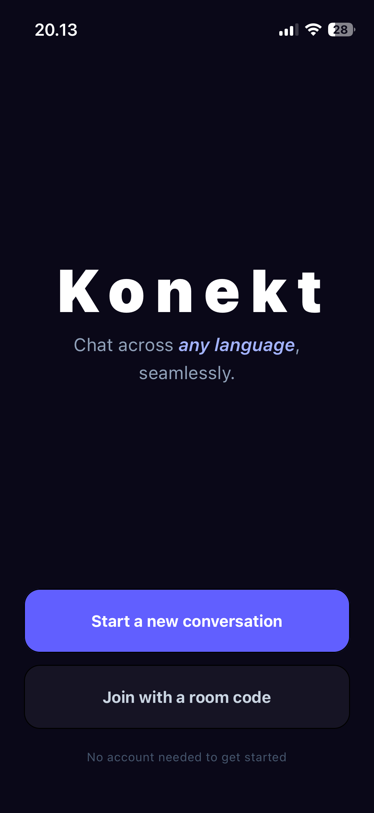
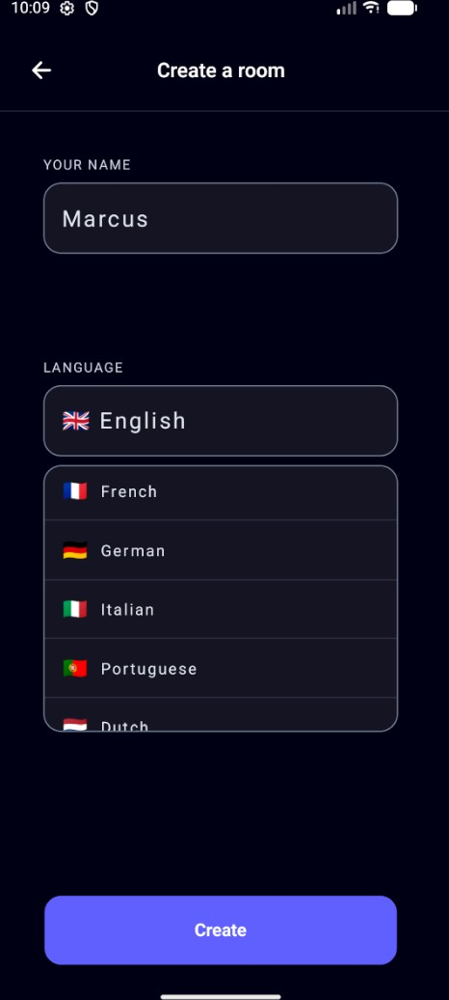
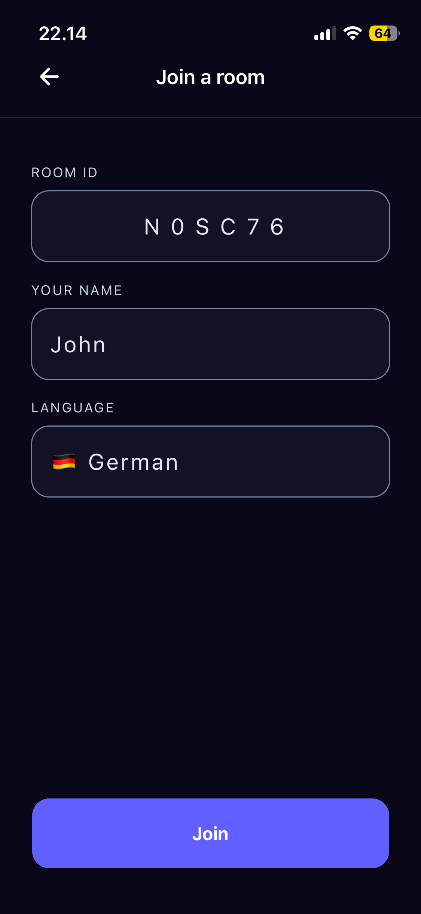

# Konekt 

A modern **React Native chat application** built with **Expo**, using **Expo Router** for navigation, **UniWind (Tailwind for React Native)** for styling, **Firebase Realtime Database** for real-time messaging, and **Google Translate API** integration for multilingual chat translation.

---

## 🖼 Screenshots

<table align="center">
  <tr>
    <td align="center"><b>Home</b><br/></td>
    <td align="center"><b>Create</b><br/></td>
  </tr>
  <tr>
    <td align="center"><b>Join</b><br/></td>
    <td align="center"><b>Translation / Chat</b><br/></td>
  </tr>
</table>

---

## ✨ Features

- ⚡ **Real-time messaging** powered by Firebase Realtime Database
- 🌍 **Message translation** via Google Translate API integration
- 🧭 **File-based routing/navigation** with Expo Router
- 🎨 **Utility-first UI styling** with UniWind (Tailwind-style classes)
- 📲 **Cross-platform mobile support** (iOS/Android via Expo)
- ☁️ **Cloud-backed architecture** for scalable message sync

---

## 🚀 Getting Started

### 1) Clone the repository

```bash
git clone https://github.com/MarcusK00/Konekt.git
cd Konekt
```

### 2) Install dependencies

```bash
npm install
# or
yarn install
# or
pnpm install
```

### 3) Configure environment variables

Create a `.env` file in the root or add app.ts in `lib/firebase/`:

```env
# Firebase
EXPO_PUBLIC_FIREBASE_API_KEY=your_api_key
EXPO_PUBLIC_FIREBASE_AUTH_DOMAIN=your_auth_domain
EXPO_PUBLIC_FIREBASE_DATABASE_URL=your_realtime_db_url
EXPO_PUBLIC_FIREBASE_PROJECT_ID=your_project_id
EXPO_PUBLIC_FIREBASE_STORAGE_BUCKET=your_storage_bucket
EXPO_PUBLIC_FIREBASE_MESSAGING_SENDER_ID=your_sender_id
EXPO_PUBLIC_FIREBASE_APP_ID=your_app_id

# Google Translate API
EXPO_PUBLIC_GOOGLE_TRANSLATE_API_KEY=your_google_translate_api_key
```

### 4) Start Expo

```bash
npx expo start
```

Then run on:
- iOS simulator
- Android emulator
- Expo Go (physical device)

---

## 💬 Realtime Chat (Firebase Realtime DB)

Konekt uses Firebase Realtime Database to:
- store chat rooms/conversations
- sync incoming/outgoing messages instantly
- reflect updates in UI with low latency

Typical flow:
1. User sends message
2. Message is written to Realtime DB
3. Subscribers/listeners receive updates in real time
4. UI re-renders with latest messages

---

## 🌐 Translation Flow (Google Translate API)

Typical translation pipeline:
1. User chooses target language
2. Message text is sent to translation service
3. Translated output is returned
4. UI displays original + translated message

---

## 🧭 Routing (Expo Router)

Konekt uses **Expo Router** for file-based navigation:
- route files map directly to screens
- nested folders can represent nested stacks/tabs
- route-based organization keeps navigation scalable

---

## 🎨 Styling (UniWind)

UI is styled with **UniWind** utility classes:
- consistent spacing/typography/colors
- rapid iteration with utility-first patterns
- shared design tokens can be centralized in Tailwind config

---

## 👤 Author

**MarcusK00**  
GitHub: [@MarcusK00](https://github.com/MarcusK00)

---

## 🙌 Acknowledgements

- [Expo](https://expo.dev/)
- [Expo Router](https://docs.expo.dev/router/introduction/)
- [UniWind](https://www.uniwind.dev/)
- [Firebase Realtime Database](https://firebase.google.com/docs/database)
- [Google Cloud Translation](https://cloud.google.com/translate)

